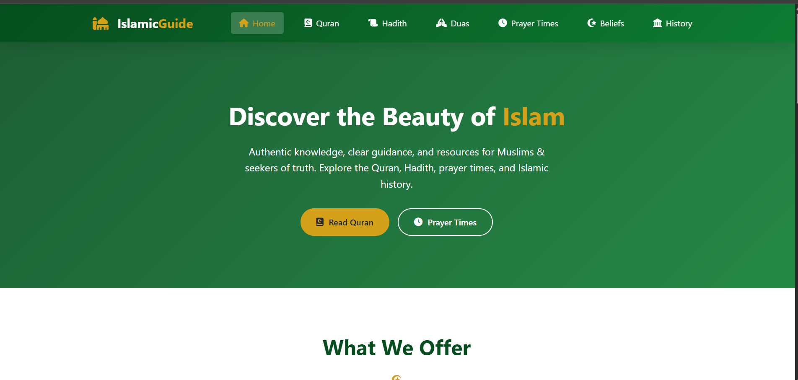

# 🕌 Islamic Guide - Comprehensive Islamic Knowledge Platform

[](https://abjisan.github.io/Islamic-website/)
[](https://pages.github.com/)
[](LICENSE)

**Live Website:** [https://abjisan.github.io/Islamic-website/](https://abjisan.github.io/Islamic-website/)

A comprehensive, fully responsive Islamic website providing authentic knowledge about Islam including the Holy Quran, Prophetic Hadith, Prayer Times, Daily Duas, Islamic beliefs, and history.

---

## 📸 Live Demo

**Visit the website:** [https://abjisan.github.io/Islamic-website/](https://abjisan.github.io/Islamic-website/)

## 📸 Website Preview




## ✨ Features

### 📖 Holy Quran
- Complete 114 Surahs with names in Arabic and English
- Verse of the day feature
- Quick access to Quran resources

### 📜 Prophetic Hadith
- Links to authentic hadith collections
- Featured hadith with references
- Easy navigation to Sahih Bukhari, Sahih Muslim

### 🕋 Prayer Times
- Accurate prayer times based on location
- Manual city/country search option
- Next prayer notification
- Hijri/Gregorian date display

### 🤲 Daily Duas
- Authentic supplications from Quran and Sunnah
- Categorized by daily activities:
  - Morning & Evening Duas
  - Before & After Eating
  - Sleeping & Waking Up
  - Entering & Leaving Mosque
- Arabic text with English translation
- Source references for each dua

### ⭐ Islamic Beliefs (Aqidah)
- Six Articles of Faith explained
- Detailed explanation of Tawheed
- Islamic creed fundamentals

### 📅 Islamic History
- Timeline of Islamic civilization
- The Rightly Guided Caliphs
- Great Islamic scholars
- Major Islamic empires

### 🎨 Design Features
- Fully responsive design (works on all devices)
- Islamic-inspired color scheme (green & gold)
- Mobile-friendly navigation
- Clean and modern interface

---

## 🛠 Technology Stack

| Technology | Purpose |
|------------|---------|
| HTML5 | Structure and content |
| CSS3 | Styling and responsive design |
| JavaScript | Interactivity and API integration |
| REST APIs | Quran verse and prayer times data |
| GitHub Pages | Hosting and deployment |

### APIs Used
- **Quran API:** `https://api.alquran.cloud/v1` - Random verse of the day
- **Prayer Times API:** `http://api.aladhan.com/v1` - Location-based prayer times

---

## 📁 Folder Structure
Islamic-website/
│
├── index.html # Homepage
├── quran.html # Quran browser
├── hadith.html # Hadith collection
├── duas.html # Daily supplications
├── prayers.html # Prayer times
├── beliefs.html # Islamic beliefs
├── history.html # Islamic history
│
├── css/
│ └── style.css # Main stylesheet
│
├── js/
│ └── main.js # JavaScript functionality
│
├── assets/
│ └── images/ # Images and icons (optional)
│
└── README.md # Project documentation


---

## 🚀 Installation & Local Development

### Prerequisites
- Any modern web browser (Chrome, Firefox, Edge, Safari)
- Text editor (VS Code, Notepad++, Sublime Text)

### Steps to Run Locally

1. **Clone the repository**
```bash
git clone https://github.com/abjisan/Islamic-website.git
